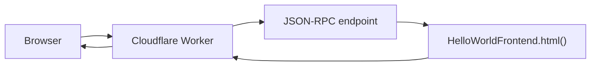

# Cloudflare Worker proxy

The Worker in `workers/proxy.ts` is an edge-hosted version of `scripts/serve.ts`. On each `GET /` request it calls `html()` on the configured contract over JSON-RPC and returns the bootstrap document. The browser still gunzips and renders the page client-side — the Worker only relays chain data.

## What it does



| Route | Behavior |
|-------|----------|
| `GET /`, `GET /index.html` | `eth_call` to `html()` on `CONTRACT_ADDRESS`, return HTML |
| Other paths | `404 Not found` |
| Non-GET | `405 Method not allowed` |

Responses use `Cache-Control: no-store` so every refresh re-reads from chain, matching the local server.

## Configuration

The Worker needs two values:

| Binding | Type | Description |
|---------|------|-------------|
| `RPC_URL` | **Secret** | JSON-RPC endpoint (may include API keys — never commit) |
| `CONTRACT_ADDRESS` | **Var** | `0x`-prefixed address of the deployed `HelloWorldFrontend` contract |

Find the contract address after Ignition deploy:

```
ignition/deployments/chain-<chainId>/deployed_addresses.json
```

Key: `HelloWorldFrontendModule#HelloWorldFrontend`

## Prerequisites

1. Node.js 22+ and `npm install` (installs `wrangler` as a dev dependency).
2. A Cloudflare account with Workers enabled.
3. Authenticate Wrangler:

```bash
npx wrangler login
```

4. A deployed contract and a reachable RPC URL for that chain (e.g. Sepolia after `npm run deploy:sepolia`).

## Deploy

Set both required values and run the deploy script:

```bash
RPC_URL=https://your-sepolia-rpc.example.com \
CONTRACT_ADDRESS=0xYourDeployedAddress \
npm run deploy:worker
```

The script:

1. Validates `RPC_URL` and `CONTRACT_ADDRESS`.
2. Uploads `RPC_URL` as a Worker secret (via a temporary file — not logged).
3. Injects `CONTRACT_ADDRESS` as a Worker var.
4. Runs `wrangler deploy`.

On success, Wrangler prints the Worker URL (typically `https://eip-8244-proxy.<account>.workers.dev`). Open it in a browser to load the onchain HTML.

### Redeploy after contract or RPC changes

Run the same command with updated values. Secrets and vars are overwritten on deploy; omitted secrets are **not** deleted.

To point at a new contract without changing the RPC:

```bash
CONTRACT_ADDRESS=0xNewAddress RPC_URL=https://same-rpc npm run deploy:worker
```

## Local development

1. Copy the example env file:

```bash
cp .dev.vars.example .dev.vars
```

2. Edit `.dev.vars` with your RPC URL and contract address.

3. Start the local Worker dev server:

```bash
npm run dev:worker
```

Wrangler serves at `http://localhost:8787` by default.

## npm scripts

| Command | Description |
|---------|-------------|
| `npm run deploy:worker` | Deploy proxy to Cloudflare (`RPC_URL` + `CONTRACT_ADDRESS` required) |
| `npm run dev:worker` | Local Worker dev server (reads `.dev.vars`) |

## Useful Wrangler commands

```bash
# Confirm Cloudflare auth
npx wrangler whoami

# Stream live logs
npx wrangler tail eip-8244-proxy

# Validate bundle without uploading
npx wrangler deploy --dry-run

# Remove the Worker
npx wrangler delete eip-8244-proxy
```

## Project layout

```
workers/proxy.ts          Worker entry — JSON-RPC proxy for html()
wrangler.jsonc            Wrangler config (name, entrypoint, compatibility date)
scripts/deploy-worker.ts  Deploy script — sets secret/var and runs wrangler deploy
.dev.vars.example         Template for local wrangler dev
```

## Security notes

- Treat `RPC_URL` like a password if it embeds an API key. Use Worker secrets, not `wrangler.jsonc` vars.
- `.dev.vars` is gitignored. Do not commit it.
- The Worker performs outbound `fetch` to your RPC on every page load. Use a rate-limited or dedicated RPC key for production.
